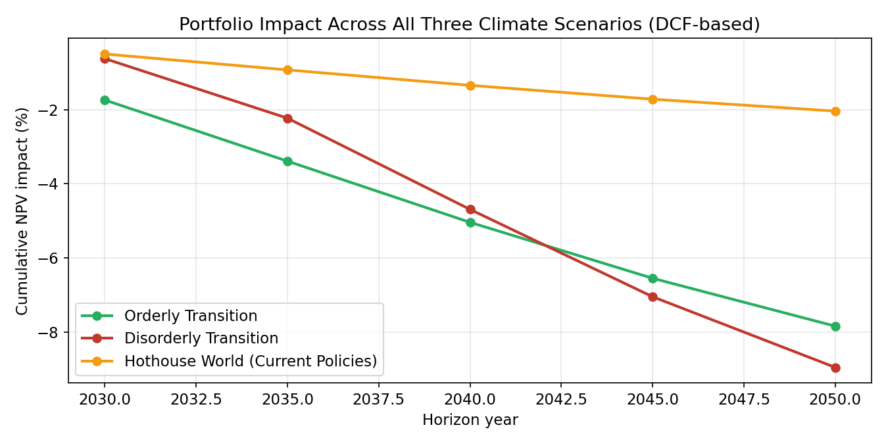
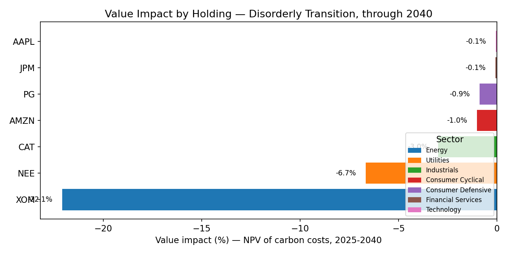
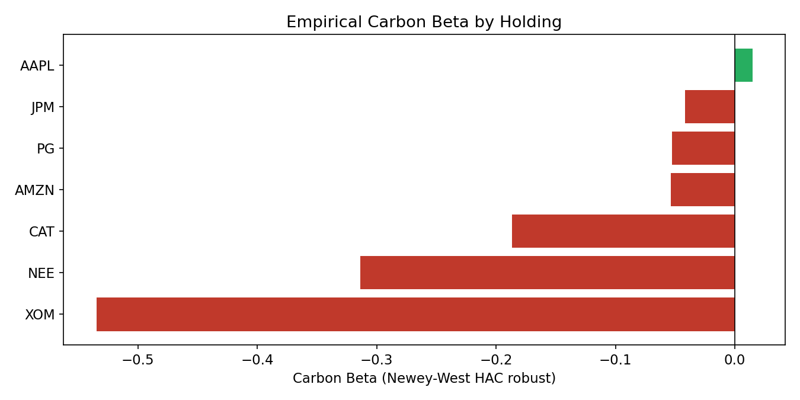
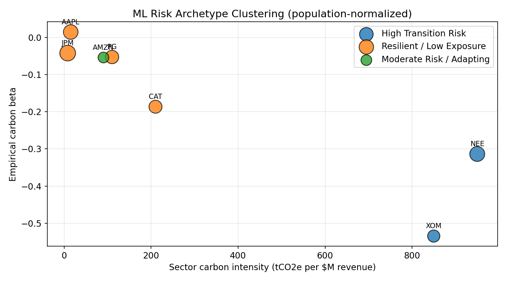
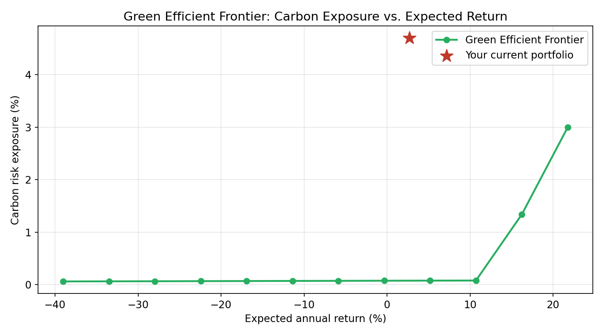

# 🌍 Climate Transition Risk Engine

A portfolio risk tool that estimates how a rising carbon price would hit
the earnings and valuation of a stock portfolio — using a proper
discounted cash flow (DCF) model, a statistical cross-check against real
market data, and machine learning to auto-discover risk archetypes.

Built around the same type of analysis regulators (Bank of England, ECB,
Fed) and asset managers (BlackRock, Franklin Templeton) run as part of
**climate stress testing** — scaled down to something you can run and
fully understand end-to-end.

## What it looks like

*(Charts below are real output from this project's own code, run on the sample portfolio.)*

**Portfolio impact across climate scenarios** — the core output. A delayed ("Disorderly") policy response starts out milder than early action, then crosses over and becomes worse by the mid-2040s — the central lesson of climate stress testing: delay costs more than early action.



**Value impact by holding** — which specific stocks drive the portfolio's risk, computed via a full multi-year DCF (not a single-year shortcut).



**Empirical Carbon Beta** — does real stock market history confirm the fundamentals-based risk ranking? Regression with Newey-West robust standard errors.



**ML-discovered risk archetypes** — clustering automatically groups holdings, with no hand-coded rules.



**Green Efficient Frontier** — the current portfolio (red star) sits well above the frontier, meaning it's carrying more carbon risk than necessary for its expected return. The optimizer finds the lowest-carbon mix achievable at any target return.



## Why this project

Climate transition risk — the financial risk of moving to a low-carbon
economy (carbon taxes, policy shifts, changing demand) — is one of the
fastest-growing areas in risk management and regulation. Every major
central bank now runs climate stress tests on the banks it supervises;
every large asset manager is building tools to quantify this across
portfolios. This project builds a simplified, from-scratch, but
methodologically honest version of that kind of tool.

## Architecture

1. **Data layer** — live company fundamentals via `yfinance`, offline
   sample fallback so it always runs.
2. **Climate layer** — sector carbon-intensity benchmarks, with an
   optional Scope 3 (supply chain) lens.
3. **Scenario layer** — carbon-price paths shaped after the NGFS
   framework: *Orderly*, *Disorderly*, *Hothouse World*.
4. **Valuation layer (DCF)** — discounts the after-tax carbon cost
   stream at a configurable WACC to a present value, expressed as % of
   market cap.
5. **Data science layer (Carbon Beta)** — two-factor regression (market
   + a **real, traded carbon ETF, KRBN**) with Newey-West HAC standard
   errors and a multicollinearity (VIF) check.
6. **Machine learning layer** — K-means or Agglomerative clustering
   groups holdings into risk archetypes from the data, not hand-coded
   rules.
7. **Optimization layer (Green Efficient Frontier)** — mean-variance-style
   constrained optimization (scipy SLSQP) that finds, for any target
   return, the long-only portfolio weights that minimize carbon exposure
   — answering "how much can I decarbonize without giving up return?"
8. **Config layer** — every assumption above (carbon prices, sector
   intensities, WACC, tax rate) lives in editable YAML files, not
   hard-coded in Python. See "Making it your own" below.
9. **Dashboard** — interactive Streamlit app tying it all together.
10. **Test suite** — 48 automated `pytest` tests covering the DCF
    discount math, YAML config loading/fallback behavior, the clustering
    fix, scenario interpolation, and the optimizer — see "Running the
    tests" below.

## Quick start

```bash
git clone <your-repo-url>
cd climate-risk-engine
pip install -r requirements.txt
streamlit run app.py
```

Upload your own `ticker,weight` CSV, or use the bundled
`sample_portfolio.csv`. Toggle "live data" off to run fully offline
against the built-in sample dataset.

## Running the tests

```bash
pip install -r requirements.txt
pytest -v
```

48 tests across 5 files, covering:

| File | What it verifies |
|---|---|
| `tests/test_risk_model.py` | DCF discount math: zero-WACC recovers the undiscounted sum, positive WACC strictly reduces PV, tax shield behaves correctly, single-year horizons, and a broad smoke test across every sector × scenario combination |
| `tests/test_config_loader.py` | Real config files load correctly; missing or malformed YAML fails safe (returns `{}`, never crashes); model defaults genuinely trace back to the YAML values |
| `tests/test_clustering.py` | The z-score fix (population-level, not centroid-level); both clustering methods run; small-sample warnings fire correctly |
| `tests/test_scenarios.py` | Carbon price interpolation, boundary clamping, scenario shape sanity checks |
| `tests/test_optimizer.py` | Weights sum to 1 and stay long-only; infeasible targets fail cleanly; the frontier is monotonic (core efficient-frontier property) |

## Making it your own — the config system

Every core assumption lives in `/config/*.yaml`, not buried in Python.
Open a file, change a number, save, re-run — no code changes needed:

| File | Controls |
|---|---|
| `config/sectors.yaml` | Carbon intensity & Scope 3 multiplier per sector |
| `config/scenarios.yaml` | Carbon price paths for each climate scenario (add new years, or a whole new scenario) |
| `config/model_params.yaml` | WACC, tax rate, valuation/horizon years, default clustering settings |

If a config file is missing or malformed, the code falls back to
sensible built-in defaults and prints a warning — it never just crashes.
This is what makes the project genuinely reusable rather than a
one-off script: you can point it at a different portfolio, a stricter
carbon price path, or a different discount rate without touching a
single line of Python.

## Project structure

```
climate-risk-engine/
├── app.py                    # Streamlit dashboard (entry point)
├── sample_portfolio.csv
├── requirements.txt
├── config/                   # <-- edit these to change model assumptions
│   ├── sectors.yaml
│   ├── scenarios.yaml
│   └── model_params.yaml
├── tests/                    # 48 pytest tests — see "Running the tests"
│   ├── conftest.py
│   ├── test_risk_model.py
│   ├── test_config_loader.py
│   ├── test_clustering.py
│   ├── test_scenarios.py
│   └── test_optimizer.py
├── screenshots/               # Real output, embedded above
└── src/
    ├── config_loader.py       # Safe YAML loading with fallback defaults
    ├── data_loader.py         # Company fundamentals (yfinance + offline fallback)
    ├── climate_data.py        # Sector carbon-intensity + Scope 3 (loads config)
    ├── scenarios.py           # NGFS-style carbon price scenarios (loads config)
    ├── risk_model.py          # DCF: carbon cost -> NPV -> valuation impact
    ├── portfolio.py           # Aggregates single-company results to portfolio level
    ├── market_data.py         # Historical prices (SPY, KRBN) + offline synthetic fallback
    ├── carbon_beta.py         # Two-factor HAC regression + VIF check
    ├── clustering.py          # K-means / Agglomerative risk archetype clustering
    └── optimizer.py           # Green Efficient Frontier (scipy SLSQP)
```

## Methodology changelog (v1 → v2)

An earlier version of this project was reviewed and three real issues
were found and fixed. Documenting this transparently, because being able
to explain what was wrong and why the fix is correct is a stronger
signal than pretending the first version was perfect:

1. **Valuation logic (`risk_model.py`)** — v1 multiplied a single year's
   carbon cost by the P/E ratio, which is mathematically equivalent to
   `carbon_cost / net_income` and breaks down for thin-margin or
   loss-making companies, with no discounting at all. **v2** discounts a
   full multi-year, after-tax carbon cost stream to present value using
   a proper DCF formula (WACC discount rate + tax shield).
2. **Regression rigor (`carbon_beta.py`)** — v1 used plain OLS standard
   errors, which understate uncertainty for autocorrelated daily
   financial returns. **v2** uses Newey-West (HAC) robust standard
   errors and reports a VIF check for multicollinearity between the
   market and carbon factors.
3. **Clustering bug (`clustering.py`)** — v1 z-scored the risk ranking
   across just the *k cluster centroids* (e.g. only 3 points for k=3),
   which is statistically noisy. **v2** standardizes against the full
   holdings population first, then aggregates per cluster — the
   statistically correct order of operations — and now warns explicitly
   when a portfolio is too small to cluster reliably.

See `REFERENCES.md` for full citations behind each of these fixes.

## Honest remaining limitations

- Revenue and margins are held constant across the projection window
  (no growth modeling) — isolates the carbon-cost effect holding
  everything else equal.
- WACC and tax rate are portfolio-wide defaults, not company-specific
  capital structures.
- Carbon intensities are sector averages, not company-disclosed figures.
- A 2-year regression window won't capture regime shifts (e.g. an energy
  price shock); a rolling-window beta would be a natural extension.

## Possible extensions

- Company-specific WACC and disclosed emissions (CDP integration).
- Rolling-window carbon beta to show sensitivity changing over time.
- Shrinkage estimators or Black-Litterman views instead of raw historical
  mean returns in the optimizer (a well-known weak point of mean-variance
  optimization — see the dashboard's methodology note).
- PDF/CSV export of the dashboard for investment-committee-style reports.
- Gaussian Mixture Models as a soft-clustering alternative, reflecting
  uncertainty in archetype assignment instead of a hard label.

## References & data sources

See [`REFERENCES.md`](./REFERENCES.md) for full citations of the academic
research, climate scenario framework, and data sources this project is
built on. All code here is original; the references document exists for
transparent attribution.

## Tech stack

Python, pandas, NumPy, yfinance, scikit-learn, statsmodels, SciPy,
PyYAML, pytest, Streamlit, Plotly.
